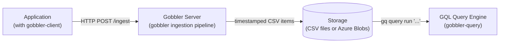

# gobbler-query

A query engine for telemetry data collected by [Gobbler](https://github.com/kozwoj/gobbler).  
Queries are written in **GQL** — a pipeline query language that is a clean subset of
[KQL (Kusto Query Language)](https://learn.microsoft.com/en-us/azure/data-explorer/kusto/query/).

---

## The Gobbler Monitoring Solution

Gobbler Query is the third component in the Gobbler ecosystem:



| Component | Repository | Role |
|---|---|---|
| **gobbler-client** | [kozwoj/gobbler-client](https://github.com/kozwoj/gobbler-client) | Go SDK — to instrument your application |
| **gobbler** | [kozwoj/gobbler](https://github.com/kozwoj/gobbler) | Server — accept, validated, buffer, and flush telemetry items to storage |
| **gobbler-query** | this repo | GQL Query Engine — analyze stored telemetry with GQL |

---

## Use Cases

- **Local monitoring** — a lightweight, zero-license alternative to cloud monitoring services for non-critical, low-volume scenarios running on a single machine, LAN or in Azure.
- **KQL learning path** — use GQL to query time-stamped CSV files with known item schemas before migrating the same queries to Azure Data Explorer (ADX / Kusto). GQL is a subset of KQL, so queries should transfer directly.
- **ADX on-ramp** — Gobbler-produced CSV files can be ingested into Azure Analytics (Kusto) for high-volume production scenarios; GQL queries serve as the development and validation stage before that migration.

---

## GQL Quick Start

GQL queries follow a pipeline structure: a **source** followed by zero or more **stages** separated by `|`. The source is a table represented by one or more CSV files with items (rows) of the same schema, which is stored with the files. 

```gql
// Count all requests in the last 24 hours
requests (last 24h) | count

// Slowest failing requests today
requests (last 24h)
| where statusCode >= 400
| sort by durationMs desc
| take 10

// Requests per user tier (join with users table)
requests (last 7d)
| join (users (*) | project userId, tier) on userId
| summarize n = count() by tier
| sort by n desc
```

See [docs/KQL-Cheat-Sheet.md](docs/KQL-Cheat-Sheet.md) for a comprehensive language reference, and [docs/gql_grammar.ebnf](docs/gql_grammar.ebnf) for the formal grammar.

---

## Installing `gq`

**Build from source** (requires Go 1.24+):

```sh
git clone https://github.com/kozwoj/gobbler-query
cd gobbler-query
go build -o gq ./cmd/gobbler-cli
```

Or install directly:

```sh
go install github.com/kozwoj/gobbler-query/cmd/gobbler-cli@latest
```

---

## Catalog Setup

Before running queries, register your data sources in the catalog.

```sh
# Register a file-mode table (local CSV files written by Gobbler)
gq catalog add requests --dir C:\gobbler-logs\requests
gq catalog add users    --dir C:\gobbler-logs\users

# List registered tables
gq catalog list
```

The catalog is stored at `<home>/.gobbler/catalog.json` by default.  
A `.gobbler.json` file in the current directory takes precedence (useful for
project-local configurations).

```sh
# Override with an explicit catalog file
gq --catalog ./my-project.json query run "requests (*) | count"
```

For Azure Blob Storage tables:

```sh
gq catalog add requests --account myaccount --container requests

# Provide the SAS key via environment variable
$env:GOBBLER_KEY_MYACCOUNT = "sv=2023-..."
```

---

## Running Queries

```sh
# Run an inline query
gq query run "requests (last 24h) | where statusCode >= 400 | count"

# Read the query from a file
gq query run --file my-query.gql

# Choose output format explicitly
gq query run "requests (*) | take 100" --format csv
gq query run "requests (*) | take 100" --format jsonl
gq query run "requests (*) | take 100" --format json

# Write output to a file
gq query run "requests (*)" --out results.csv
```

Output format defaults to `table` when stdout is a terminal, and `csv` when piped.

Run `gq --help`, `gq catalog --help`, or `gq query --help` for full usage.

---

## Using as a Go Library

```go
import (
    "github.com/kozwoj/gobbler-query/api"
    "github.com/kozwoj/gobbler-query/query/catalog"
)

cat := catalog.Catalog{
    "requests": {
        TypeName:      "requests",
        StorageBucket: "requests",
        Mode:          catalog.StorageModeFile,
        OutputDir:     "/gobbler-logs",
    },
}

result, err := api.Execute(
    `requests (last 24h) | where statusCode >= 400 | summarize n = count() by region`,
    cat,
    0, // batchSize 0 = default (512)
)
if err != nil {
    log.Fatal(err)
}
for _, row := range result.Rows {
    fmt.Println(row...)
}
```

`api.Execute` returns a `*Result` with:
- `Schema []batch.ColumnMeta` — column names and types
- `Rows [][]any` — output rows (`nil` cell = null)
- `Nulls [][]bool` — parallel null bitmap

---

## Architecture

The query engine is a pull-based operator pipeline:

```
GQL string
    │
    ▼
Parser → AST
    │
    ▼
Logical Planner → Logical Plan
    │
    ▼
Validator (type inference + compatibility checks)
    │
    ▼
Physical Planner → Operator tree
    │
    ▼
Execution (pull batches from SourceOp through the operator chain)
    │
    ▼
Result
```

Key design documents:

| Document | Description |
|---|---|
| [docs/execution-pipeline.md](docs/execution-pipeline.md) | Batch model, operator catalogue, streaming vs blocking operators |
| [docs/source-layer.md](docs/source-layer.md) | Catalog, schema parsing, file selection by time window |
| [docs/cli-design.md](docs/cli-design.md) | `gq` command structure, noun/verb design, catalog file resolution |
| [docs/gql_grammar.ebnf](docs/gql_grammar.ebnf) | Formal EBNF grammar for GQL |
| [docs/KQL-Cheat-Sheet.md](docs/KQL-Cheat-Sheet.md) | KQL/GQL language reference |

---

## GQL vs KQL

GQL is an intentional subset of KQL. Queries written in GQL run unchanged on
Azure Data Explorer. The following KQL features are not in GQL Phase 1:

| KQL feature | GQL status |
|---|---|
| `extend`, `parse`, `mv-expand` | Not supported |
| Outer / left / right join kinds | Inner join only |
| Sub-field access on `dynamic` (`meta.field`) | Not supported (dynamic is opaque) |
| `let` bindings, functions | Not supported |
| `render` (visualisation) | Not supported |

---

## License

MIT
