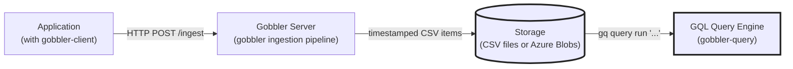
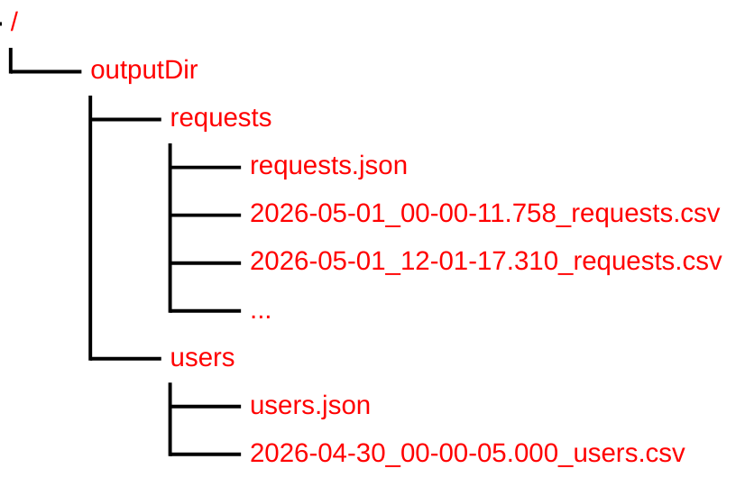

# Gobbler Query Overview

**Gobbler Query** is a query engine for telemetry data collected by [Gobbler](https://github.com/kozwoj/gobbler) written in Go. It is the third component in the Gobbler suite:



| Component | Repository | Role |
|---|---|---|
| **gobbler-client** | [kozwoj/gobbler-client](https://github.com/kozwoj/gobbler-client) | Go SDK — to instrument your application |
| **gobbler** | [kozwoj/gobbler](https://github.com/kozwoj/gobbler) | Server — accept, validated, buffer, and flush telemetry items to storage |
| **gobbler-query** | *this repo* | GQL Query Engine — analyze stored telemetry with GQL |

---

Queries are written in a pipeline-style query language **GQL** (Gobbler Query Language), which is a subset of [KQL (Kusto Query Language)](https://learn.microsoft.com/en-us/azure/data-explorer/kusto/query/), with limitations and one modification, described in `GQL vs KQL` section.

## Use Cases

Gobbler Query was written as an exercise of implementing a pipeline query engine for time-stamped telemetry data in Go. Although the work can be classified as "academic exercise", the Gobbler suite has been sufficiently tested to be used in these use cases:    

- **Local monitoring** — a lightweight, low-cost alternative to cloud monitoring services for non-critical scenarios running on a single machine, LAN or in Azure.
- **KQL learning path** — use GQL to query time-stamped CSV files with known item schemas before migrating the same queries to Azure Data Explorer (ADX / Kusto). GQL is a subset of KQL, so queries should transfer with small, local modification (in GQL the source/input stage has explicit time window).
- **ADX on-ramp** — Gobbler-produced CSV files can be ingested into Azure Analytics (Kusto) for high-volume production scenarios, and GQL queries can serve as the development and validation stage before that migration.

---

## How Gobbler Stores Data

Gobbler Query analyzes data ingested and stored by Gobbler server. Gobbler ingests, validates and stores telemetry items of predefined types. Items of the same type are stored in type-specific CSV files. Once an items is validated Gobbler prepends the ingest timestamp in the first property called `timestamp`. Since the items are stored in the order they arrived, they are stored in the ingest time sequence. Gobbler creates one directory (or Azure container) per item type. The directory name comes from the `folder` field in the item definition (defaults to type `name` if `folder` is not given). Each directory holds item schema file and a series of time-stamped CSV data files, one per rotation period:




**`{typeName}.json`** — written by Gobbler when the directory is first created. It lists column names and types in order. Gobbler Query reads this once per query to parse CSV rows, so no access to the running Gobbler instance is needed.

**`YYYY-MM-DD_HH-MM-SS.mmm_{typeName}.csv`** — one file per rotation period. The timestamp in the filename is the ingest time of the **first item** stored in that file. Files have no header row - the order of columns matches the schema file. 

### Why time windows matter

Since items are stored in the ingest time sequence, the data file names can be used to decide when the file starts. Hence, gobbler queries can skip entire files without opening them. A query for `(last 24h)` reads only files whose names fall within that window — 2 files out of 14 in a week of data where rotation time is 12 hours. This matters most for Azure Blob Storage, where listing and downloading blobs has a per-operation cost.

The same model applies to Azure Blob mode: one container per item type, one `{typeName}.json` blob for the schema, and one append blob per rotation period following the same naming convention.

---
## GQL Language Overview

A GQL query is a pipeline starting with **source** and followed by zero or more **stages** separated by `|`:

```
tableName (timeWindow) | stage | stage | ...
```

The source is the name of a registered table (a single item type from Gobbler). The time window, which is mandatory in GQL, selects which files to read. Stages transform the row stream in order — each stage receives the full output of the previous one.

**Time window forms:**

| Form | Example | Meaning |
|---|---|---|
| Full scan | `requests (*)` | All files with items of that type |
| Relative | `requests (last 24h)` | Files from the last 24 hours |
| Absolute | `requests (datetime(2026-05-01) .. datetime(2026-05-08))` | Fixed time range of up to millisecond precision |

**Stages:**

| Stage | Example | Description |
|---|---|---|
| `where` | `where statusCode >= 400` | Filter rows by a boolean expression |
| `project` | `project userId, dur = durationMs` | Select, rename, or compute columns |
| `summarize` | `summarize n = count() by region` | Group and aggregate; no `by`means whole table |
| `join` | `join (users (*)) on userId` | Inner join with result of sub-query on a key column |
| `sort` | `sort by durationMs desc` | Order results |
| `take` | `take 10` | Limit row count to first N |
| `count` | `count` | Shorthand for `summarize count()` |

**Aggregation functions:** `count()` · `min(col)` · `max(col)` · `avg(col)` · `sum(col)` · `dcount(col)`

**Null handling:** Any field can be null. An empty CSV cell is null for all types. Use `isnull(col)` / `isnotnull(col)` to test. Null propagates through arithmetic expressions.

See [docs/gql_grammar.ebnf](docs/gql_grammar.ebnf) for the complete formal grammar.

---

## GQL Quick Start

GQL queries follow a pipeline structure: a **source** followed by zero or more **stages** separated by `|`. The source is a table represented by one or more CSV files with items (rows) of the same type/schema (the {typeName}.json file). 

```gql
// Count all requests in the last 24 hours
requests (last 24h) | count

// Slowest failing requests today
requests (last 24h)
| where statusCode >= 400
| sort by durationMs desc
| take 10

// Requests per user tier (join with users table)
requests (last 7d)
| join (users (*) | project userId, tier) on userId
| summarize n = count() by tier
| sort by n desc
```

See [docs/gql_grammar.ebnf](docs/gql_grammar.ebnf) for the formal grammar.

---

## Installing Gobbler Query CLI

**Build from source** (requires Go 1.24+):

```sh
git clone https://github.com/kozwoj/gobbler-query
cd gobbler-query
go build -o gq ./cmd/gobbler-cli
```

Or install directly:

```sh
go install github.com/kozwoj/gobbler-query/cmd/gobbler-cli@latest
```

To see all CLI commands run `gq` or `gq --help` or `gq -h` from the command line. 

---

## Catalog Setup

Gobbler Query needs information where the data (tables represented as CSV file or blobs) and their schemas are stored. Before running queries, register your data sources in the catalog. For tables stored in files provide their directories. 

```sh
# Register a file-mode table (local CSV files written by Gobbler)
gq catalog add requests --dir C:\gobbler-logs\requests
gq catalog add users    --dir C:\gobbler-logs\users

# List registered tables
gq catalog list
```

The catalog is persisted at `<home>/.gobbler/catalog.json` by default, and for the two definitions above will be: 

```json
[
  {
    "table": "requests",
    "mode": "file",
    "dir": "C:\gobbler-logs\requests"
  },
    {
    "table": "users",
    "mode": "file",
    "dir": "C:\gobbler-logs\users"
  },
]
``` 

A `.gobbler.json` file in `<home>/.gobbler` directory takes precedence (useful for project-local configurations), but can be overwritten for individual queries with provided catalog file.  

```sh
# Override with an explicit catalog file
gq --catalog ./my-project.json query run "requests (*) | count"
```

For tables stored in Azure Blob Storage provide account name and place the SSA key in environment variable named `GOBBLER_KEY_{keyName}` as shown in the example below (CLI capitalizes value of the --account argument):

```sh
gq catalog add requests --account myaccount --container requests

# Provide the SAS key via environment variable
$env:GOBBLER_KEY_MYACCOUNT = "sv=2023-..."
```
---

## Running Queries

```sh
# Run an inline query
gq query run "requests (last 24h) | where statusCode >= 400 | count"

# Read the query from a file
gq query run --file my-query.gql

# Choose output format explicitly
gq query run "requests (*) | take 100" --format csv
gq query run "requests (*) | take 100" --format jsonl
gq query run "requests (*) | take 100" --format json

# Write output to a file
gq query run "requests (*)" --out results.csv
```

Output format defaults to `table` when stdout is a terminal, and `csv` when piped.

Run `gq --help`, `gq catalog --help`, or `gq query --help` for full usage.

---

## Using as a Go Library

```go
import (
    "github.com/kozwoj/gobbler-query/api"
    "github.com/kozwoj/gobbler-query/query/catalog"
)

cat := catalog.Catalog{
    "requests": {
        TypeName:      "requests",
        StorageBucket: "requests",
        Mode:          catalog.StorageModeFile,
        OutputDir:     "/gobbler-logs",
    },
}

result, err := api.Execute(
    `requests (last 24h) | where statusCode >= 400 | summarize n = count() by region`,
    cat,
    0, // batchSize 0 = default (512)
)
if err != nil {
    log.Fatal(err)
}
for _, row := range result.Rows {
    fmt.Println(row...)
}
```

`api.Execute` returns a `*Result` with:
- `Schema []batch.ColumnMeta` — column names and types
- `Rows [][]any` — output rows (`nil` cell = null)
- `Nulls [][]bool` — parallel null bitmap

The test file `api\execute_test.go` contains examples of initializing the `catalog.Context` and executing queries against the `gobbler-query` test data set in `testdata`. 

---

## Architecture

The query engine is a pull-based pipeline in which each stage operator pulls data from the operator in front of it. Gobbler Query parses a query, converts it into a logical plan of the pipeline, validates the plan against the input table schemas, builds the operators tree, and calls Next() on the last operator until there is no more data, and the Result has been assembled:

```
GQL query string
    │
    ▼
Parser → AST
    │
    ▼
Logical Planner → Logical Plan
    │
    ▼
Validator (type inference + compatibility checks)
    │
    ▼
Physical Planner → Operator tree
    │
    ▼
Execution (pull batches from SourceOp through the operator chain)
    │
    ▼
Result
```

Key design documents:

| Document | Description |
|---|---|
| [docs/execution-pipeline.md](docs/execution-pipeline.md) | Batch model, operator catalogue, streaming vs blocking operators |
| [docs/source-layer.md](docs/source-layer.md) | Catalog, schema parsing, file selection by time window |
| [docs/cli-design.md](docs/cli-design.md) | `gq` command structure, noun/verb design, catalog file resolution |
| [docs/gql_grammar.ebnf](docs/gql_grammar.ebnf) | Formal EBNF grammar for GQL |

---

## GQL vs KQL

GQL is an intentional subset of KQL with one extension. The extension, or optimization, is that the Source operator, the first operator in the pipeline that reads data from the SCV files/blobs, has `time window` argument. The argument is used to filter the CSV files/blobs relevant to the query.  

After removing the time window, queries written in GQL should run unchanged on Azure Data Explorer against the data ingested by Gobbler. The following KQL features are not in GQL Phase 1:

| KQL feature | GQL status |
|---|---|
| `extend`, `parse`, `mv-expand` | Not supported |
| Outer / left / right join kinds | Inner join only |
| Sub-field access on `dynamic` (`meta.field`) | Not supported (dynamic is opaque) |
| `let` bindings, functions | Not supported |
| `render` (visualisation) | Not supported |

---

## License

MIT
